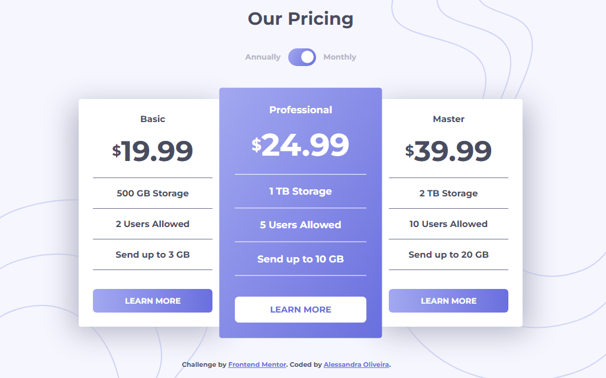
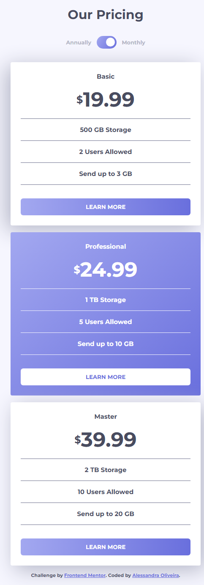
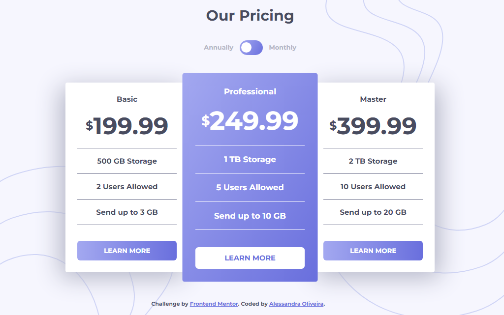
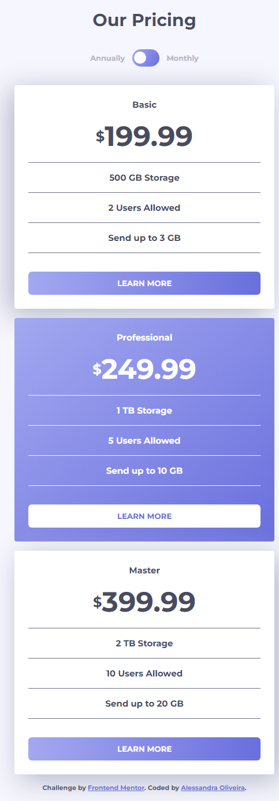

# Frontend Mentor - Pricing Component With Toggle Solution

This is a solution to the [Pricing component with toggle challenge on Frontend Mentor](https://www.frontendmentor.io/challenges/pricing-component-with-toggle-8vPwRMIC).

## Table of contents

- [Overview](#overview)
  - [The challenge](#the-challenge)
  - [Screenshot](#screenshot)
  - [Links](#links)
- [My process](#my-process)
  - [Built with](#built-with)
- [Author](#author)

## Overview

This is my solution to the pricing component with toggle challenge. It was built entirely with HTML, CSS and JavaScript.

### The challenge

Users should be able to:

- View the optimal layout for the component depending on their device's screen size
- Control the toggle with both their mouse/trackpad and their keyboard

### Screenshot

**Monthly Prices:** the following screenshots are the solution with the monthly prices

**Desktop**

**Mobile**

**Annually Prices:** the following screenshots are the solution with the annually prices

**Desktop**

**Mobile**

### Links

- [Solution on Frontend Mentor](https://your-solution-url.com)
- [Live Site](https://your-live-site-url.com)

## My process

### Built with

- Semantic HTML5 markup
- CSS custom properties
- JavaScript

## Author

- LinkedIn - [Alessandra Oliveira](https://www.linkedin.com/in/alessandra-santos-oliveira/)
- Frontend Mentor - [@itsale-o](https://www.frontendmentor.io/profile/itsale-o)
- Twitter - [@itsale_o](https://www.twitter.com/itsale_o)
